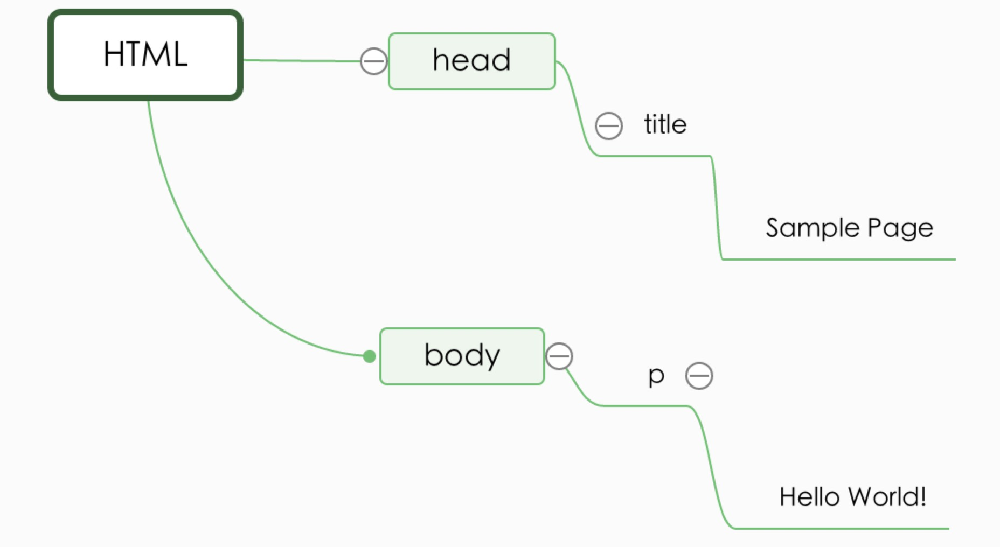

## 第一章

### JavaScript（JS） 不等于 ECMAScript(ES)

JS和ES通常被用来表达相同的含义，但JS的含义要比ES广泛得多。

> JS = ES + DOM + BOM

其中ECMAScript是核心，文档对象模型(DOM)和浏览器对象模型(BOM)都是JS独特又不可或缺的部分。

### ECMAScript

ECMAScript由ECMA-262定义。是对实现这个标准各方面内容语言的描述，规定了JS的以下部分，

- [x] 语法
- [x] 类型
- [x] 语句
- [x] 关键字
- [x] 保留字
- [x] 操作符
- [x] 对象

目前正式发布版本是ECMAScript 6即ECMAScript 2015.

### DOM(文档对象模型 Document OBject Model)

DOM定义如下：
> DOM是针对XML但经过扩展用于HTML的**应用程序编程接口（API）**。DOM把整个页面映射为一个多层节点结构。
HTML或XML页面中每个组成部分都是某种类型的节点，这些节点包含着不同类型的数据。

以最简单的页面举例：

````code
<html>
    <head>
        <title>Sample Page</title>
    </head>
    <body>
        <p>Hello World!</p>
    </body>
</html>
````

以上HTML页面DOM的分层节点图如下：



DOM有3级，由W3C负责制定，分别是DOM1级，DOM2级和DOM3级。

* 1级主要规定如何映射文档结构;
* 2级在1级的基础上扩充了鼠标和用户页面事件、范围、遍历（迭代DOM文档的方法），也通过对象接口增加了对CSS的支持。2级引入如下子模块：
    * DOM 视图(DOM Views) -- 定义跟踪不同文档（如应用CSS之前和之后的文档）视图的接口；
    * DOM事件（DOM Events） -- 定义事件和事件处理接口；
    * DOM样式（DOM Style）-- 定义基于CSS为元素应用样式的接口。 
    * DOM遍历和范围（DOM Traversal and Range）-- 定义遍历和操作文档树的接口。
* 3级进一步扩展DOM，引入以统一方式加载和保存文档的方法，新增验证文档的方法。 

### BOM(浏览器对象模型 Browser Object Model)

习惯上将所有针对浏览器的Javascript扩展算作BOM的一部分，包括：

* 弹出新浏览器窗口的功能；
* 移动、缩放和关闭浏览器窗口的功能；
* 提供浏览器详细信息的navigator对象；
* 提供浏览器加载页面的详细信息的location对象；
* 提供用户显示器分辨率详细信息的screen对象；
* 对cookies的支持；
* 对XMLHttpRequest和IE的ActiveXObject等自定义对象的支持。

BOM没有标准可循，每个浏览器都有自己的实现。但都会为一些事实标准如window对象和navigator对象定义属性和方法。
