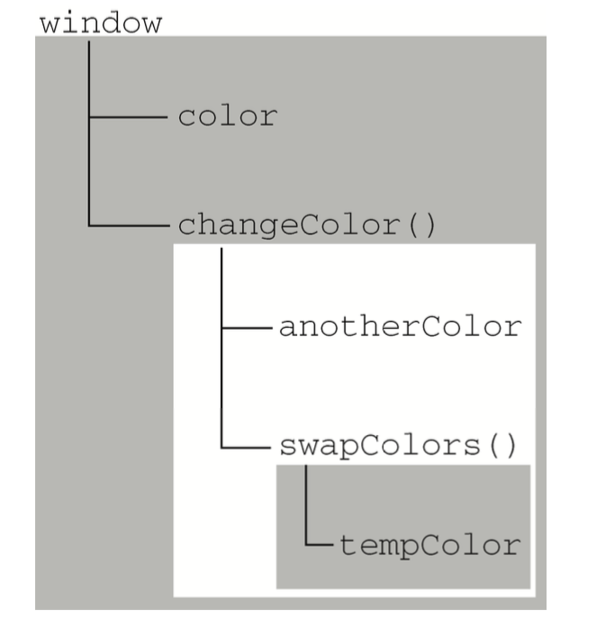

## 第四章：变量、作用域和内存问题

1. 理解基本类型和引用类型的值
2. 理解执行环境
3. 理解垃圾收集

### 4.1 基本类型和引用类型的值

ECMAScript的变量可能包含两种不同数据类型的值：基本类型值和引用类型值。在赋值时，解析器就必须确定这个值是基本类型还是引用类型值。

* 基本类型值： 简单的数据段。除对象外的其他数据类型。
* 引用类型值：可能由多个值构成的对象。对象。

#### 执行复制操作时：

* 基本类型：创建一个新的变量，并把该值分配到新变量的位置上。
* 引用类型：创建一个新的变量，把该值的引用分配给新变量。

#### 传递参数

所有的函数参数都是**按值传递**的。即把值赋值给命名参数`arguments`的一个元素。

当参数为对象类型时，对象的引用通过按值传递后也能被处理函数引用到。

#### 检测类型：

`typeof`是检测**基本数据类型**的得力助手。但只能判断是否为对象类型。

`instanceof`操作符用于检测==对象的具体类型==。语法如下：

````js
result = variable instanceof constructor;
````

如果变量是给定引用类型的实例，那么`instanceof`操作符就会返回`true`。

根据所有引用类型的值都是Object的实例，因此在检测`instanceof  Object`时，始终会返回true。

### 4.2 执行环境和作用域

#### 执行环境

执行环境（execution context）简称为环境。它定义了变量或函数有权访问的范围。

每个环境都有一个与之关联的**变量对象（variable object）**，环境中定义的所有变量和函数都保存在这个对象中。

全局环境是最外围的执行环境。根据ECMAScript实现宿主环境的不同，执行环境的对象也不一样（web浏览器中是window对象）。

当某个环境中所有代码执行完毕，该环境随之销毁。全局环境直到程序退出或关闭网页时——才会被销毁。

**每个函数都有一个执行环境**。当执行流进入一个函数时，该函数对应的执行环境就会被推入一个环境栈中，在函数执行完后，栈将其环境推出，把控制权返回给其之前的执行环境。

#### 作用域

一段代码在执行环境中执行时，会创建变量对象的一个作用域（scope chain），以保证对**执行环境有权访问的所有变量和函数的有序访问**。

作用域链的最前端始终是当前执行的代码所在环境的变量对象（这个对象包含作用于内的变量），下一个变量来自外部环境，再下一个则来自再下一个外部环境，一直延续到全局执行环境。全局执行环境的变量对象始终都是作用域链中的最后一个对象。

作用域的图表表示如下：




矩形表示特定执行环境。其中内部环境可以通过作用域访问所有外部环境，但外部环境不能访问内部环境中的任何变量和函数。任何环境都可以向上走索作用域链，但都不能向下搜索从而进入另一个执行环境。

#### 延长作用域链

思路是在作用域链的前端临时增加一个变量对象，该变量对象会在代码执行后被移除。当执行流得以进入下列任何一个语句时，作用域链就会被加长：

- [x] try-catch 语句的catch块；
- [x] with语句

这两个语句都会在作用域链前端增加一个变量对象，with将指定对象添加到作用域中（？？）；catch会创建一个新的变量对象，其包含的是被抛出的错误对象的声明。

#### 没有块级作用域

由花括号封闭的代码块如if语句、for语句**没有**单独作用域。

* 声明变量时：

	* 使用`var`声明的变量会自动添加到最接近的环境中（函数内部就是函数的局部环境，**with语句中最接近的就是函数环境**）。
	* 省略`var`关键字时，变量就会自动被添加到全局环境中。

* 查询标识符：

在某个环境中必须通过搜索来确定该标识符时，搜索过程从**作用域链最前端**开始，向上逐级查询与给定名字匹配的标识符。如果在局部环境中找到则停止搜索，变量就绪，否则将追溯到全局变量的变量对象。若全局环境中也没有这个标识符，则意味着变量未声明。

### 4.3 垃圾收集

JavaScript具有自动垃圾回收机制：找回不再继续使用的变量，然后释放其占用的内存。垃圾回收器在固定时间间隔执行这一操作。

两种方法：

* 标记清除：进入环境时声明，退出环境时离开。
* 引用计数：引用次数为0时回收。

对开发人员来说，最好的办法是通过将其值**设置为null来释放引用**——解除引用。

:sparkles:

