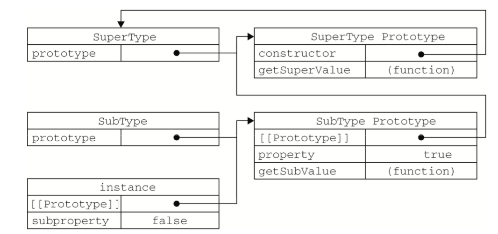

## 第六章：面向对象的程序设计

1. 理解对象属性
2. 理解并创建对象
3. 理解继承

对象是"无序属性的集合，其属性可以包含包含基本值、对象或者函数"。每个对象都是基于一个引用类型创建的。

### 6.1 理解对象

#### 属性类型

ECMA-262第5版描述了两种属性：数据属性和访问器属性。（放在两对方括号中以表示该特性是内部值。）

* 数据属性：包含一个数据值的位置，有4个描述其行为的特性。
	* [[Configurable]]：能否通过删除属性，修改属性或是修改为访问器属性。默认true。
	* [[Enumerable]]：能否通过for-in循环返回属性。默认true。
	* [[Writable]]：能否修改属性的值。默认true。
	* [[Value]]：包含这个属性的数据值。读取属性值时，从这个位置读；写入属性时，把新值保存在这个位置。
	
使用`Object.defineProperty()`方法可以修改默认属性的特性，接收3个参数：属性所在的对象、属性的名字和一个描述符对象。其中描述符对象的属性必须是：configurable、enumberable、writable和value。设置其中的一或多个值，就可以修改对应的特性值。

就像下面这样：

````js
var person = {};
Object.defineProperty(person, "name", {
	writable: false,
	value: "Nicholas"
});
````

name属性是只读的。为它指定新值时，在非严格模式下，赋值操作将被忽略；严格模式下，赋值操作将会导致错误。

在把configurable设置为false后，修改其他设置将会收到限制。

* 访问器属性：不包含数据值，它们包含一对getter和setter函数。在读取访问器属性时会调用getter函数，这个函数返回有效的值；在写入访问器属性时，会调用setter函数并传入新值。访问器属性有4个特性：
	* [[Configurable]]：能否通过删除属性，修改属性或是修改为数据属性。默认true。
	* [[Enumerable]]：能否通过for-in循环返回属性。默认true。
	* [[Get]]：在读取属性时调用的函数。默认为undefined。
	* [[Value]]：在写入属性时调用的函数，默认值为undefined。

访问器属性不能直接定义，必须使用Object.defineProperty()来定义。

#### 定义多个属性

Object.defineProperties()，这个方法可一次定义多个属性。

````js
// _xxx下划线开始，表示只能通过对象方法访问的属性。
var book = {};
Object.defineProperties(book, {
	_year: {
		value: 2004
	},
	
	edition: {
		value: 1
	},
	
	year: {
		get: function() {
			return this._year;
		},
		
		set: function(newValue) {
			if(newValue > 2004) {
				this._year = newValue;
				this.edition += newValue - 2004;
			}
		}
	}
});
````

以上代码同时定义了两个数据属性（_year和edition）和一个访问器属性（year）。

#### 读取属性的特性

Object.getOwnPropertyDescriptor()，取得给定属性的描述符。接收两个参数：属性所在的对象和要读取其描述符的属性名称。返回一个对象，对象的属性与访问器属性和数据属性对象的属性一一对应。

````js
// 数据属性：
var descriptor = Object.getOwnPropertyDescriptor(book, "_year");
console.log(descriptor.value); // 2004
console.log(descriptor.configurable); // false
console.log(typeof descriptor.get); // "undefined"
// 访问器属性：
var descriptor = Object.getOwnPropertyDescriptor(book, "year");
console.log(descriptor.value); // undefined
console.log(descriptor.enumerable); // false
console.log(typeof descriptor.get); // "function"
````

### 6.2 创建对象

Object构造函数或对象字面量来创建对象会产生大量重复代码，人们研究了工厂模式、构造函数模式、原型模式、组合使用构造函数模式和原型模式、动态原型模式和寄生构造函数模式等不同创建对象方法。接下来一一介绍。

#### 工厂模式

广为人知的一种模式，抽象了创建具体对象的过程。又因为ES中无法创建类，于是用函数来封装创建对象的细节。

````js
function createPerson(name, age, job) {
	var o = new Object();
	o.name = name;
	o.age = age;
	o.job = job;
	o.sayName = function() {
		alert(this.name);
	};
	return o;	
}

var person1 = createPerson("Nicholas", 29, "Software Engineer");
var person2 = createPerson("Greg", 27, "Doctor");

````

调用`createPerson()`函数便可以多次创建包含三个属性和一个方法的对象，但是无法进行对象识别。（没有对引用类型进行实例化的过程）

#### 构造函数模式

ECMAScript中的构造函数可以用来创建特定类型的对象。

````js
function Person(name, age, job) {
	this.name = name;
	this.age = age;
	this.job = job;
	this.sayName = function() {
		alert(this.name);
	};	
}
````

大写字母P将构造函数Person与普通函数区分开，创建实例时必须使用new操作符。

也可以判断对象类型：

````js
alert(person1 instanceof Object); // true
alert(person1 instanceof Person); // true
````

针对构造函数的几点解释：

* 构造函数可以当做普通函数使用。直接调用时，属性和方法都会被添加给当前作用域。
* 构造函数的主要问题是每个方法都要在每个实例上重新创建一遍。

针对问题可以进行以下改进：

````js
function Person(name, age, job) {
	 this.name = name;
	 this.age = age;
	 this.job = job;
	 this.sayName = sayName;
}

function sayName() {
    alert(this.name);
}
````

这样，每个实例都共享全局作用域中共同的函数sayName()，缺点是对象的私有方法暴露在全局作用域中，破坏其封装性。这个问题可以通过原型模式解决。

#### 原型模式

每个函数都有一个prototype（原型）属性，这个属性是一个指针，指向一个对象，这个对象的用途是包含可以由特定类型的所有实例共享的属性和方法。那么可以将对象实例共享的属性和方法直接添加到原型对象中。

代码如下：

````js
function Person() {}

Person.prototype.name = "Nicholas";
Person.prototype.age = 29;
Person.prototype.job = "Software Engineer";
Person.prototype.sayName = function() {
	alert(this.name);
};

var person1 = new Person();
person1.sayName();  // "Nicholas"

var person2 = new Person();
person2.sayName();  // "Nicholas"

alert(person1.sayName == person2.sayName); // true

````

* 理解原型对象

无论什么时候，只要创建了一个新函数，就会根据一组特定的规则为该函数创建一个prototype属性，这个属性指向函数的原型对象。

默认情况，所有原型对象都会自动获得一个constructor（构造函数）属性，这个属性包含一个指向prototype属性所在函数的指针。拿前面的例子举例，Person.prototype.constructor 指向 Person。

这里先给出一个实例化，添加属性和删除属性过程中各对象与原型对象的关系：



当代码读取某个对象的某个属性时，都会执行搜索。搜索首先从对象实例本身开始，如果在实例中找到了具有给定名字的属性，则返回该属性的值；若没有，则继续搜索指针指向的原型对象。

需要注意的是，可以通过对象实例访问保存在原型中的值，但是不能通过对象实例重写原型中的值。在实例中添加的与原型对象重名的属性只会在实例中创建该属性（屏蔽原型中的那个）。

- [ ] hasOwnProperty()方法可以检测一个属性是存在于实例中，还是存在于原型中。存在于实例中返回true，否则返回false。
- [ ] hasPrototypeProperty()方法也可以检测属性。存在于原型对象中返回true，否则返回false。用法略有不同

如：

````js
// 对象构造代码同上。

var person1 = new Person();
alert(person1.hasOwnProperty("name")); //false
alert(hasPrototypeProperty(person, "name")); //true
````

* 原型与in操作符

in操作符有两种使用方式：单独使用和在for-in循环中使用。

- [ ] 单独使用时，in操作符会在通过对象能够访问给定属性时返回true，无论该属性存在于实例中还是原型中。

````js
function Person() {}

person.prototype.name = "aaaa";

var person1 = new Person();
console.log("name" in person1);  // true
````

- [ ] for-in循环时，返回的是所有能够通过对象访问的、可枚举的(enumerated)属性,同时包括实例中和原型对象中的对象。

要**取得对象上所有可枚举的实例属性**，可以使用ECMAScript5 的Object.keys()方法。这个方法接受一个对象作为参数，返回一个包含所有可枚举属性的字符串数组。

````js
function Person(){
}
Person.prototype.name = "Nicholas";
Person.prototype.age = 29;
Person.prototype.job = "Software Engineer";
Person.prototype.sayName = function(){
    console.log(this.name);
};

var keys = Object.keys(Person.prototype);
console.log(keys);       // ["name", "age", "job", "sayName"]
var p1 = new Person();
p1.name = "Rob";
p1.age = 31;
var p1keys = Object.keys(p1);
console.log(p1keys);    //["name", "age"]

````

- [ ] Object.getOwnPropertyNames()返回所有实例的属性，无论是否可枚举。

````js
var keys = Object.getOwnPropertyNames(Person.prototype);
console.log(key); // ["constructor", "name", "age", "job", "sayName"]
````

总结一下上文提到的6个方法：

1. obj.hasOwnProperty("property_name")：属性在实例中存在返回true，否则false
2. hasPrototypeProperty(obj, "property_name")：属性在原型对象中存在返回true，否则false
3. property_name in obj：属性无论在实例还是原型中，存在即返回true
4. for-in循环：返回实例和原型中可通过对象访问的、可枚举的全部属性
5. Object.keys(obj)：返回实例中所有可枚举的属性，返回一个字符串数组
6. Object.getOwnPropertyNames()： 返回所有实例的属性，无论是否可枚举

* 更简单的原型语法

减少不必要代码输入，同时视觉上体现出原型封装的特点：

首先用对象字面量的方法重写原型对象：

````js
function Person(){
}

Person.prototype = {
	name: "Nicholas",
	age: 29,
	job: "Software Engineer",
	sayName: function() {
		console.log(this.name);
	}
};
````

此时，constructor不再指向Person了（指向重写时的构造函数Object）。解决方案是显式设置constructor的值：

````js
function Person(){
}

Person.prototype = {
	**constructor: Person,**
	name: "Nicholas",
	age: 29,
	job: "Software Engineer",
	sayName: function() {
		console.log(this.name);
	}
};
````

但这种显式重设操作会导致constructor可枚举特性变为true。

可以这样：

````js
Object.defineProperty(Person.prototype, "constructor", {
	enumerable: false,
	value: Person
});
````

#### 组合使用构造模式和原型模式

#### 动态原型模式和寄生构造函数模式


