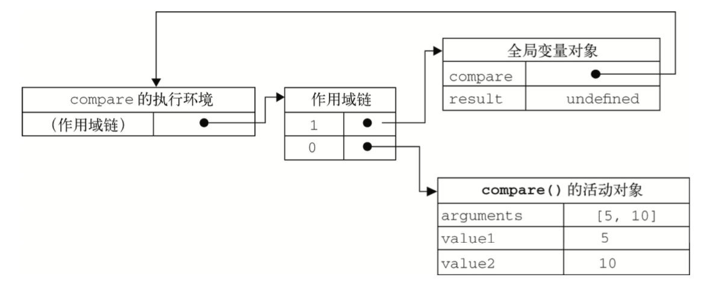
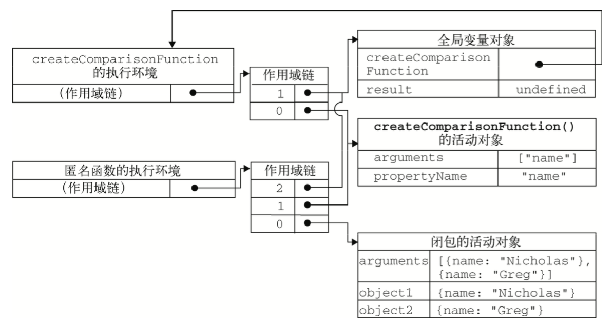

## 第七章：函数表达式

本章内容

- [ ] 函数表达式的特征
- [ ] 使用函数实现递归
- [ ] 使用闭包定义私有变量

定义函数有两种方式：

1. 函数声明：函数声明提升（意味着函数声明可以放在调用语句后面）
2. 函数表达式：创建匿名函数，在使用前必须赋值。

### 7.1 递归

递归函数是在一个函数通过名字调用自身的情况下构成的。

function factorail(num) {
	if(num <= 1) {
		return 1;
	}else {
		return num * arguments.callee(num-1);
	}
}

auguments.callee：一个指向正在执行的函数的指针。
auguments.caller：在一个函数中调用另一个函数，被调用的函数会自动生成一个caller属性，指向调用它的函数对象。若当前函数未被调用或并非被其他函数调用，则caller为null。

### 7.2 闭包

闭包是指有权访问另一个函数作用域中的变量

````js
function createComparisonFunction(propertyName) {
	return function(object1, object2) {
		**var value1 = object1[propertyName];
		var value2 = object2[propertyName];**
		
		if(value1 < value2) {
			return -1;
		}else if (value1 > value2) {
			return 1;
		}else {
			return 0;
		}
	}
}
````

即使内部函数被返回后在其他地方被调用了，但它仍然可以访问外部函数传入的变量propertyName。

当某个函数被调用时，会创建一个执行环境（execution context）及相应的作用域链。

后台每个执行环境都有一个表示变量的对象——**变量对象**。全局环境的变量对象始终存在，而函数这样的局部环境的变量对象，只在函数执行过程中存在。

一般来说，作用域链可按如下表示：



每个函数在**创建**时会预先包含全局变量的作用域链，这个作用域链被保存在内部的[[scope]]属性中。**调用**compare()函数会为函数创建一个执行环境，通过复制函数[[scope]]属性中的对象构建起执行环境的作用域链。此后，函数的活动对象被创建并被推入执行环境作用域的前端，构成整个函数执行过程中的作用域链。

作用域链本质上是一个指向变量对象的指针列表，只引用但不实际包含变量对象。

一般来说，函数执行完毕后，局部活动对象就会被销毁，内存中仅仅包含全局作用域。

但在闭包中情况有所不同，以下是以上闭包调用过程中产生的作用域链之间的关系：

````js
var compare = createComparisonFunction("name");
var result = compare({name: "Nicholas"}, {name: "Greg"});
````



当createComparisonFunction()函数返回后，其执行环境的作用域会被销毁，但它的活动对象仍然会留在内存中，直到匿名函数被销毁后，createComparisonFunction()的活动对象才会被销毁。

````js
compare = null; // 像这样解除引用即可。
````

#### this对象

this对象是在运行时基于函数的执行环境绑定的：在全局函数中，this等于windows；当函数作为某个对象的方法调用时，this等于那个对象。

但是匿名函数的执行函数具有全局性，因此其this对象通常指向windows。

#### 内存泄露

闭包会引用包含函数的整个活动对象。因此有必要手动设置活动对象为null，以减少其引用数，确保正常回收其占用的内存。

### 7.3 模仿块级作用域


