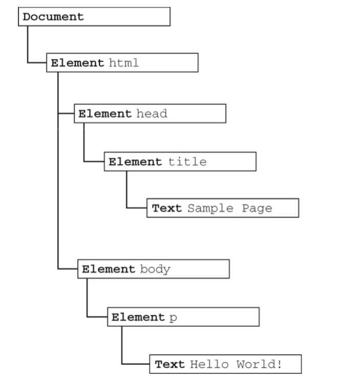

## 第十章：DOM

本章内容

- [ ] 理解包含不同层次节点的DOM
- [ ] 使用不同的节点类型
- [ ] 克服浏览器兼容性问题及各种陷阱

DOM（文档对象模型）是针对HTML和XML文档的一个API（应用程序接口）。DOM描绘了一个层次化的节点树，允许开发人员添加、移除和修改页面的某一部分。

本章主要讨论与浏览器中的HTML页面相关的DOM1级的特性和应用，以及JavaScript对DOM1级的实现。

> IE中所有的DOM对象都是以COM对象的形式实现的，这意味着IE中的DOM对象与原生JavaScript对象的行为或活动特点并不一致。

### 10.1 节点层次

DOM可以将任何HTML和XML文档描绘成一个由多层节点构成的结构。节点分为几种不同类型，每种类型分别表示文档中不同的信息及标记。每个节点都拥有各自的特点、数据和方法，也与其他节点存在某种关系。节点之间的关系构成了层次，而所有页面标记则表现为一个以特定节点为根节点的树形结构。

以下面的HTML为例：

````js
<html>
	<head>
		<title>Sample Page</title>
	</head>
	<body>
		<p>Hello World!</p>
	</body>
</html>
````

层次结构如下图：



* **文档节点**（Document）是每个文档的根节点。
* 文档节点只有一个子节点，即<html>元素，称之为**文档元素**。每个文档只能有一个文档元素。
* 每一段标记都可以通过树中的一个节点表示：HTML元素通过元素节点表示，特性通过特性节点表示，文档类型通过文档类型表示，注释通过注释节点表示。总共有12种节点类型，这些类型都继承自同一个基类型。


#### 更可靠的能力检测


